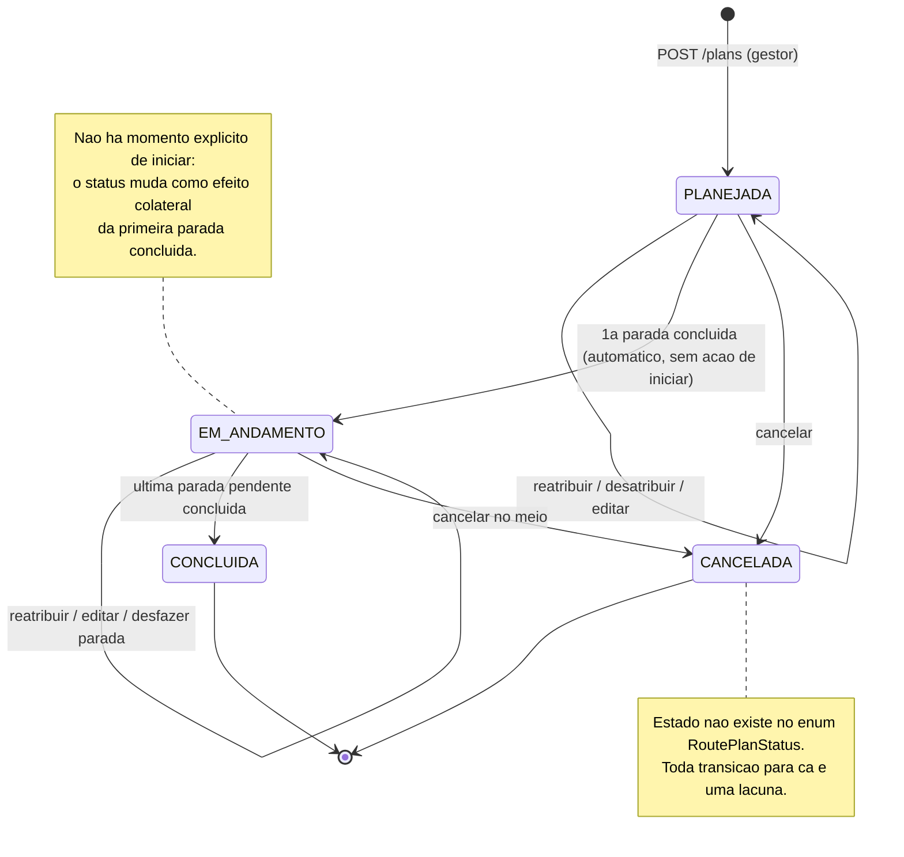

# Levantamento do trâmite de rota — 2026-08-25

Entrega da Fase B de `specs/11-caminho-feliz-rotas.md`: mapeamento de **todos** os caminhos
do trâmite de rota (não só o caminho feliz), contra o código real, antes de qualquer linha
de código nova. Fonte: `core-api/.../routeplan/*`, `apps/web/src/pages/RoutePlansPage.tsx`,
`apps/web/src/pages/DriverRoutePage.tsx`, `apps/mobile/src/screens/RouteScreen.tsx`,
`ChatService.sendRoutePlanMessage`.

## Superfície real da API hoje

`RoutePlanController` expõe **seis** endpoints, e é isso — não existe nenhum outro caminho
de escrita:

| Método | Rota | Quem | O que faz |
|---|---|---|---|
| POST | `/v1/routes/plans/suggest-order` | gestor | sugere ordem, não persiste nada |
| POST | `/v1/routes/plans` | gestor | cria (ordem já confirmada pelo gestor) |
| GET | `/v1/routes/plans` | gestor | lista paginada |
| POST | `/v1/routes/plans/{id}/assign` | gestor | designa motorista |
| GET | `/v1/routes/plans/active` | motorista | rota ativa do token |
| POST | `/v1/routes/plans/stops/{stopId}/complete` | motorista | conclui uma parada |

**Não existe:** cancelar, editar, excluir, desatribuir, reatribuir, desfazer conclusão de
parada. Não é "existe mas com atrito" — é ausência total, tanto de endpoint quanto de UI.

## Diagrama do trâmite

O bloco de cima é o que existe hoje. O bloco de baixo (tudo que envolve `CANCELADA`, mais as
auto-transições de reatribuir/editar/desfazer) é o que a operação real precisa e **não tem
nenhuma implementação** — é a lacuna mapeada, não um desenho futuro.

## Caminho a caminho

### 1. Caminho feliz (as 5 etapas da spec 11)

| Etapa | Estado | Observação |
|---|---|---|
| 1. Gestor monta rota | ✅ existe | `RoutePlansPage.tsx`, ponto cadastrado ou avulso, valida data passada e janela invertida no backend |
| 2. Sistema sugere ordem | ⚠️ existe, com atrito | OSRM `/table` + OR-Tools; reordenação manual é **botão sobe/desce** (`mover(key, ±1)`), não arrastar-e-soltar |
| 3. Atribuição | ⚠️ existe, dois caminhos divergentes | ver item 6 abaixo — comportamento de notificação é diferente em cada um |
| 4. Motorista executa | ❌ **só no web** | ver item 5 — o app mobile não tem essa tela |
| 5. Conclusão | ✅ existe | status derivado automaticamente, `ordem_real_executada` gravada |

### 2. Cancelamento (em qualquer etapa) — **não existe**

Nem endpoint, nem status `CANCELADA` no enum (`RoutePlanStatus` tem só `PLANEJADA`,
`EM_ANDAMENTO`, `CONCLUIDA`), nem botão na UI. O "Cancelar" que aparece em
`RoutePlansPage.tsx:437` é o botão de fechar o modal de criação, não cancelamento de rota.

**Consequência prática:** rota criada por engano, ou cancelada pelo cliente, fica na lista
para sempre como `PLANEJADA`, poluindo o painel e contaminando qualquer métrica futura de
"rotas não concluídas". Hoje só sai com `DELETE` manual no banco.

Vale para `ROTA` e `TRANSFER` igualmente — nenhum tem tratamento próprio.

### 3. Edição de rota já criada — **não existe, e é bloqueada no ORM**

Não é só falta de endpoint: os campos estão `updatable = false` no JPA, deliberadamente.
- `RoutePlan`: `categoria`, `dataExecucao` imutáveis.
- `RouteStop`: `tipo`, `label`, `lat`, `lon`, `collectionPointId`, `ordemSugerida` imutáveis.

**Consequência:** endereço digitado errado, ou data que precisa mudar, exige recriar a rota
do zero — e como não dá pra cancelar a antiga (item 2), sobram duas rotas, uma delas lixo.

### 4. Reatribuição / desatribuição — **ativamente bloqueada**

`RoutePlanService.assignDriver:275-277` lança `RoutePlanAlreadyAssignedException`
("Esta rota já está designada a outro motorista.") se já houver outro motorista.
`RoutePlan.designarMotorista` só escreve, nunca limpa — não existe caminho para voltar a
`driver_id = null`.

O bloqueio foi uma decisão consciente (o comentário no código diz "nunca sobrescreve
silenciosamente"), e está certo em não sobrescrever calado — mas hoje **não existe a
alternativa explícita**. Motorista que faltou/adoeceu = rota travada no motorista errado,
sem saída pelo produto.

### 5. Motorista executando pelo app mobile — **não existe**

Achado mais sério do levantamento. A aba "Rota" do app (`HomeTabs.tsx:39` →
`RouteScreen.tsx`) é um **buscador de endereço genérico** (digita origem e destino, calcula
trajeto) — não mostra a rota atribuída. `apps/mobile/src/api/client.ts` não tem **nenhuma**
referência a `routePlans`, `/routes/plans` ou `completeStop`.

O próprio docstring do arquivo admite isso, mas está desatualizado (`RouteScreen.tsx:70-73`):

> "A origem é a designação do dia? Não: enquanto não existir plano de rota com paradas
> (`route_plan`/`route_stop`, extensão seguinte da spec 02), o caso real é o motorista
> digitando o endereço da entrega."

`route_plan`/`route_stop` **já existem** desde a migration V20. O comentário descreve um
mundo que acabou, e a tela nunca foi atualizada junto.

Execução de rota só funciona em `apps/web/DriverRoutePage.tsx` (visão de motorista dentro do
painel web). Ou seja: a etapa 4 do caminho feliz depende do motorista abrir o **navegador**,
não o app que foi feito pra ele.

### 6. Atribuição tem dois caminhos com comportamento diferente

| Caminho | Push pro motorista? |
|---|---|
| `POST /{id}/assign` (tela de rotas) | ❌ nenhuma notificação |
| `ChatService.sendRoutePlanMessage` (anexar rota no chat) | ✅ `notifyUser(..., "Nova rota atribuída", ...)` (`ChatService.java:144`) |

O gestor não tem como saber que a escolha do caminho muda se o motorista é avisado ou não.
Responde a pergunta da spec 11 ("transição 3→4: push de verdade ou só se ele abrir o app?"):
**depende de por onde o gestor atribuiu** — o que é pior que qualquer uma das duas respostas.

### 7. Visibilidade do progresso pro gestor — **não existe**

- `RoutePlansPage.tsx` não referencia `concluidaEm`, `ordemRealExecutada` nem itera `stops`
  na listagem — o gestor vê o status da rota, não o progresso parada a parada.
- `useEffect(refresh, [])` roda **uma vez**, sem polling — mesmo o status muda só se a
  página for recarregada à mão.

### 8. Rota "esquecida" (motorista não reage) — **sem sinal nenhum**

Nenhum job, alerta ou query sobre `data_execucao` vencida (confirmado por varredura em todo
`core-api`). Rota atribuída na segunda que ninguém tocou continua `PLANEJADA` na sexta,
visualmente idêntica a uma criada agora.

### 9. Parada concluída fora da ordem sugerida — **funciona, mas ninguém vê**

`completeStop:320-322` calcula `ordemReal = (concluídas até agora) + 1` e grava. Então o
desvio **é permitido e registrado corretamente** — é o caminho mais bem resolvido dos
"não-felizes". O que falta é qualquer consumo desse dado: nenhuma tela compara
`ordem_sugerida` × `ordem_real_executada`.

Também não existe desfazer: `completeStop` é idempotente (`if (stop.isConcluida()) return`),
então parada marcada por engano não tem volta.

### 10. Múltiplas rotas ativas no mesmo motorista — **silenciosamente truncado**

`activeForDriver:288-294` busca todas as rotas `PLANEJADA`/`EM_ANDAMENTO` do motorista e
devolve `.findFirst()` — a mais recente por `createdAt`. Nada impede o gestor de criar duas
rotas pro mesmo motorista no mesmo dia; a segunda simplesmente **some** da visão dele, sem
erro nem aviso pra ninguém.

### 11. Fallback do OSRM é invisível pro gestor — mas o dado existe

`RouteMatrixService.Matriz` é um record `(double[][] distanciasM, String fonte)` — o backend
**sabe** se usou OSRM ou o fallback haversine, e loga (`log.warn`, nunca silencioso no
servidor). Mas `suggestOrder` devolve `List<StopInput>` e descarta o `fonte` no caminho.

Ou seja: não é preciso instrumentar nada novo pra avisar o gestor de que a sugestão veio
degradada — é só parar de jogar fora a informação que já existe.

### 12. TRANSFER: o botão "Iniciar" na verdade conclui a origem

`DriverRoutePage.tsx:99-101` rotula o botão da primeira parada como "Iniciar" e o da segunda
como "Concluir". Mas os dois chamam `completeStop` — "Iniciar" marca a **origem como
concluída**. Funciona, mas o rótulo mente sobre a semântica, e é o que faz `TRANSFER` ter um
"momento de início" que `ROTA` não tem (ver observação sobre telemetria abaixo).

## Conversas de texto — o que cada tela diz hoje, e o que ela não tem o que dizer

Copy real extraída de `apps/web/src/i18n/locales/pt.json` (`pages.routePlans`,
`pages.driverRoute`). O padrão que salta: **existe copy para todo o caminho feliz e para
falha técnica, e nenhuma para decisão operacional** — porque essas telas não existem.

### Gestor — tela de Rotas

| Estado | Copy hoje |
|---|---|
| Cabeçalho | "Pontos de coleta e entrega — monte a rota, revise a ordem sugerida e designe um motorista." |
| Vazio | "Nenhuma rota cadastrada ainda." |
| Sem motorista | "Sem motorista designado" |
| Sugerindo ordem | "Sugerir ordem" → "Sugerindo..." |
| Erro ao sugerir | "Falha ao sugerir ordem" |
| Data no passado | "Data de execução não pode ser no passado." |
| TRANSFER inválido | "Transfer exige exatamente 2 paradas: origem e destino." |
| Sucesso | "Rota criada." |

**Sem copy porque a tela não existe:** confirmação de cancelamento ("Cancelar esta rota? O
motorista será avisado."), aviso de reatribuição ("Esta rota já está com {motorista}.
Transferir para {novo}?"), aviso de sugestão degradada ("Não foi possível calcular a
distância real — a ordem sugerida usou distância em linha reta."), rota parada ("Atribuída
há 3 dias, sem nenhuma parada concluída").

Nota: a única mensagem existente sobre reatribuição está no **backend**, sem tela que a
mostre em contexto — `RoutePlanAlreadyAssignedException`: "Esta rota já está designada a
outro motorista." Ela chega como erro genérico, não como uma decisão que o gestor possa
tomar.

### Motorista — tela de Rota (web)

| Estado | Copy hoje |
|---|---|
| Sem rota | "Nenhuma rota atribuída no momento." |
| Lista | "Minha rota" · "{n} parada(s)" · "Coleta"/"Entrega" |
| Ação | "Concluir" → "Marcando..." |
| Sucesso | "Parada concluída." |
| Erro | "Falha ao concluir parada" |
| TRANSFER | "Transfer" · "Origem"/"Destino" · "Valor combinado: R$ {valor}" · "Iniciar"/"Concluir" |

**Problemas de copy identificados:**
- **"Iniciar" mente** (item 12): o botão marca a origem como concluída, não inicia nada.
- **"Nenhuma rota atribuída no momento."** é ambíguo nos dois casos que mais importam: não
  distingue "seu gestor ainda não te passou rota hoje" de "você tem duas rotas e só uma
  aparece" (item 10).
- Nenhuma copy reconhece conclusão fora de ordem — o motorista pula a parada 2 e nada na
  tela comenta, mesmo o backend registrando o desvio.

### Motorista — app mobile

Não há copy a levantar: a tela de rota atribuída não existe (item 5). A aba "Rota" diz
"Buscar endereço...", "Calcular rota", "Não foi possível falar com o servidor." — vocabulário
de um buscador de trajeto, não de uma rota de trabalho atribuída.

## Impacto na telemetria (`route_plan_event`)

**Uma das 3 métricas que a spec 11 pede não é mensurável como está definida.** "Tempo médio
entre `atribuida` e `iniciada`" pressupõe um evento de início — mas **não existe momento de
"iniciar rota"** no produto: `PLANEJADA → EM_ANDAMENTO` acontece como efeito colateral da
primeira parada concluída (`completeStop:324-326`). Então essa métrica hoje mediria
"atribuída até primeira parada concluída", que é outra coisa (inclui o deslocamento inteiro
até o primeiro ponto).

Duas saídas, decisão pra Fase C: (a) aceitar e renomear a métrica pro que ela realmente
mede, ou (b) introduzir uma ação explícita de "iniciar rota" no app do motorista — que é
justamente o que `TRANSFER` já finge ter (item 12).

## Taxonomia de eventos proposta

Decisão explícita por caminho, conforme o plano pedia. `route_plan_event` só consegue
registrar transição que **existe** — evento de caminho inexistente entra na tabela abaixo
como "depende de implementar o caminho primeiro".

| Caminho mapeado | Vira `tipo`? | Observação |
|---|---|---|
| Criação | ✅ `criada` | direto em `create` |
| Sugestão de ordem pedida | ✅ `ordem_sugerida` | `metadado`: `fonte` da matriz (OSRM ou fallback) — resolve o item 11 e vira dado histórico de qualidade da sugestão |
| Ordem confirmada ≠ sugerida | ✅ `ordem_ajustada_manualmente` | `metadado`: nº de posições trocadas. Exige `create` receber a sugestão original pra comparar — hoje ela não chega no backend |
| Atribuição | ✅ `atribuida` | `metadado`: `origem` (`tela_rotas` ou `chat`) — torna o item 6 mensurável em vez de anedótico |
| Início real da rota | ⚠️ `iniciada` | só existe se a decisão do item anterior for (b); senão é redundante com a 1ª `parada_concluida` |
| Parada concluída | ✅ `parada_concluida` | `metadado`: `ordem_sugerida`, `ordem_real`, `fora_de_ordem` (bool) — dado do item 9, que hoje é gravado mas nunca lido |
| Rota concluída | ✅ `concluida` | direto em `completeStop` |
| Cancelamento | ⏸ `cancelada` | depende de implementar o caminho (item 2) |
| Reatribuição | ⏸ `reatribuida` | depende do item 4; `metadado`: motorista anterior |
| Edição pós-criação | ⏸ `editada` | depende do item 3; `metadado`: campos alterados |
| Desfazer conclusão de parada | ❌ não | não implementar o caminho agora; se implementar depois, vira `parada_reaberta` |
| Rota esquecida (item 8) | ❌ não é evento | é **ausência** de evento — detecta por query (`data_execucao` vencida sem `concluida`), exatamente o que a spec 11 já previu |

## Gaps priorizados

Ordem por "quebra a operação" → "incomoda" → "polish".

**Bloqueante — a operação não fecha sem isso**
1. **App mobile não mostra a rota atribuída** (item 5) — a etapa 4 do caminho feliz não
   existe no app do motorista. Tudo o mais é secundário perto disso.
2. **Cancelamento** (item 2) — sem isso, todo erro de digitação vira lixo permanente.
3. **Reatribuição/desatribuição explícita** (item 4) — motorista que faltou trava a rota.

**Fricção séria — o gestor volta pro WhatsApp por causa disso**
4. **Push inconsistente entre os dois caminhos de atribuição** (item 6).
5. **Gestor não vê progresso** (item 7) — o "liga pro motorista pra saber se entregou" que a
   spec 11 quer eliminar continua necessário.
6. **Edição de rota** (item 3) — menos urgente que cancelar, porque com cancelamento existe
   o paliativo "cancela e recria".

**Barato e de alto retorno — dado já existe, só não é usado**
7. **Expor `Matriz.fonte` no `suggestOrder`** (item 11) — avisar que a sugestão veio
   degradada, sem instrumentar nada novo.
8. **Mostrar `ordem_sugerida` × `ordem_real`** (item 9) — o dado já é gravado.

**Correção pontual**
9. **`activeForDriver` truncando silenciosamente** (item 10) — no mínimo logar; idealmente
   impedir ou expor as duas.
10. **Rótulo "Iniciar" do TRANSFER** (item 12) — resolver junto da decisão sobre `iniciada`.

**Sem alerta de rota esquecida** (item 8) fica fora da lista porque a própria spec 11 já
decidiu: o dado passa a existir com `route_plan_event`, o alerta vem quando for priorizado.
